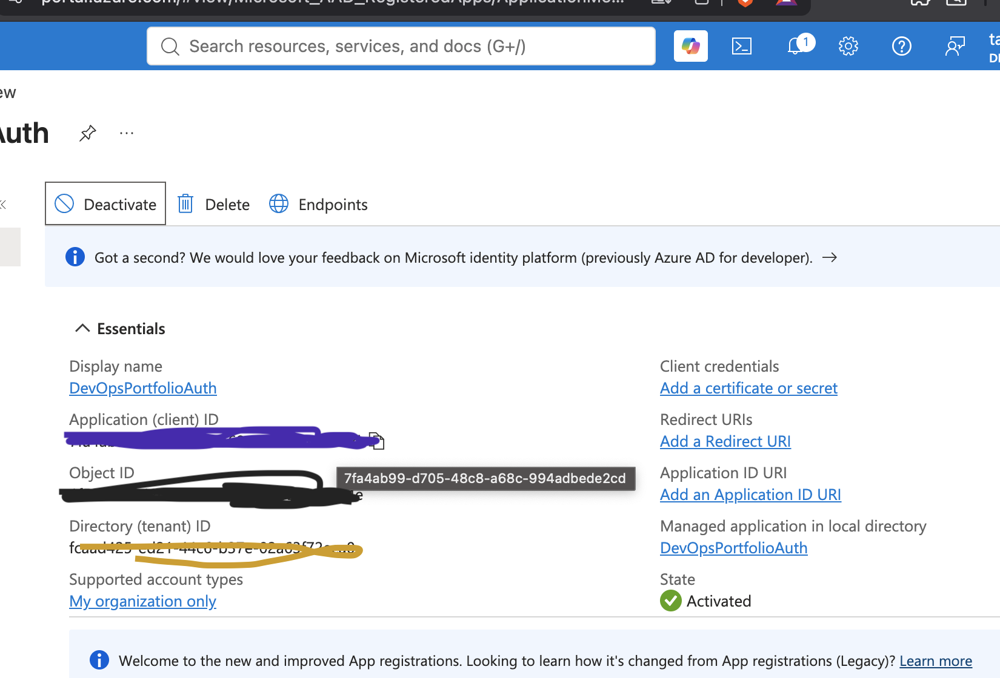

# Azure Cloud Identity & App Registration

## Overview

This project demonstrates the creation and configuration of an application in Microsoft Entra ID (formerly Azure Active Directory).

---

## Key Concepts Learned

- Application Registration
- Client ID
- Tenant ID
- Object ID
- OAuth 2.0 Authentication
- Cloud Identity Management

---

## Screenshot

---

## Skills Demonstrated

- Cloud Administration
- Identity and Access Management (IAM)
- Microsoft Azure
- Microsoft Entra ID
- Authentication Fundamentals
